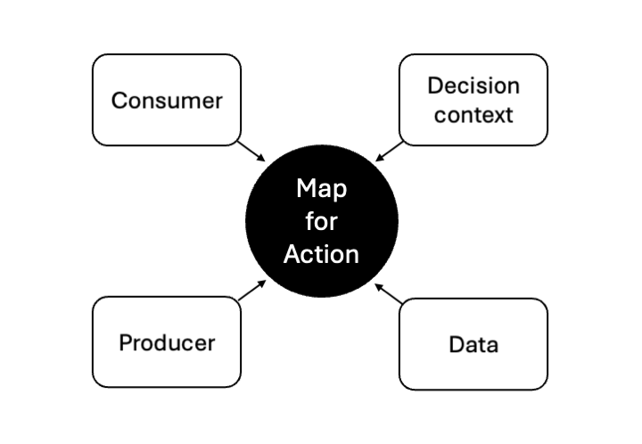
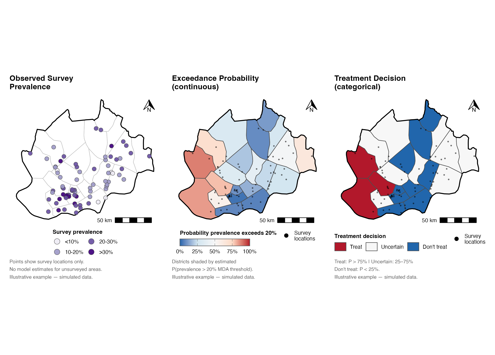
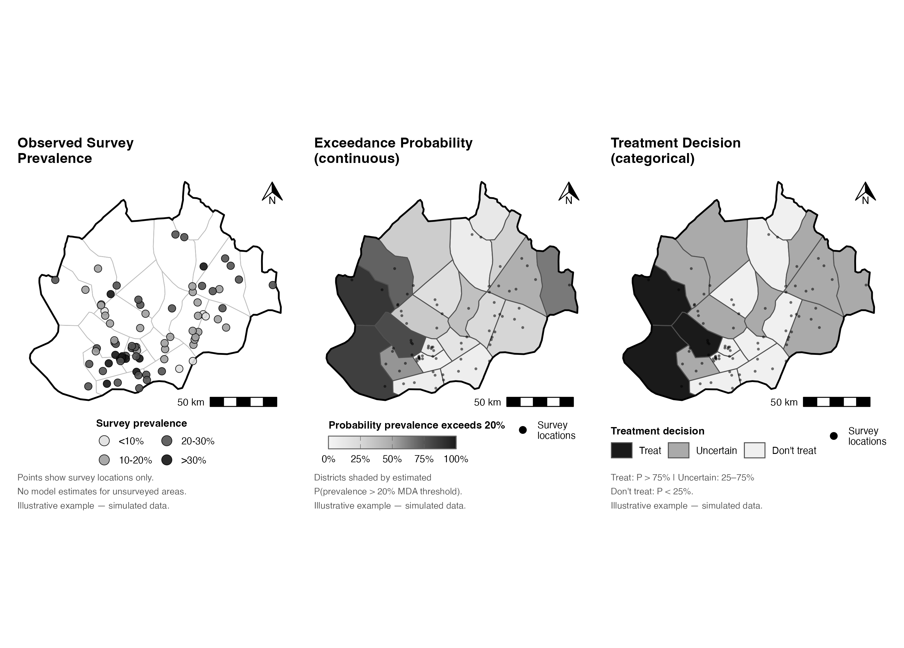

# Maps for Action in Neglected Tropical Disease Control Programs— Supplementary Figures

**Supplementary digital materials for:**

> Stearns, E. R. (in review). *Maps for Action in Neglected Tropical Disease Control Programs*. *New Directions for Evaluation.*

This repository contains the publication figures and fully reproducible R code for the maps presented in the manuscript. The maps use **Nord-Ouest, Cameroon** (21 implementation units) as an illustrative geographic setting. Survey point data are simulated; IU boundaries are real. All figures are labeled *"Illustrative example — simulated data."* Grayscale versions are submitted for journal publication; color versions are provided here for accessibility and open sharing.

---

## Figures

### Figure 1. Foundational Elements of a Map



*A map of Nord-Ouest, Cameroon annotated to illustrate the foundational cartographic elements referenced in the manuscript.*

A [print-quality PDF](figures/figure1_foundational-elements-of-a-map.pdf) is also available.

---

### Figure 2. From Survey Data to Treatment Decision

Three-panel figure illustrating how model-based geostatistics can transform sparse survey observations into actionable district-level treatment decisions:

- **(A) Observed survey prevalence** — 200 simulated survey locations, each assigned a spatially correlated prevalence value drawn from a Gaussian process surface. Displayed as colored/shaded points.
- **(B) Exceedance probability (continuous)** — each implementation unit (IU) shaded by the estimated probability that true prevalence exceeds the 20% MDA treatment threshold. Values are manually specified to be spatially plausible relative to Panel A, illustrating what a fitted model-based geostatistical (MBG) model would produce.
- **(C) Treatment decision (categorical)** — IUs classified as *Treat* (P > 75%), *Uncertain* (25–75%), or *Don't treat* (P < 25%) based on the exceedance probabilities in Panel B. Small dots show survey locations for spatial reference.

**Color version**



**Grayscale version** *(as submitted to journal)*



*Illustrative example — simulated data. MDA threshold: 20%. Treat: P > 75% | Uncertain: 25–75% | Don't treat: P < 25%.*

Print-quality PDFs: [color](figures/figure2_color.pdf) | [grayscale](figures/figure2_grayscale.pdf)

---

## How to reproduce

### 1. Clone the repository

```bash
git clone https://github.com/[username]/maps-for-action-in-ntds_nde.git
cd maps-for-action-in-ntds_nde
```

### 2. Install R dependencies

All packages are available on CRAN. Run once in R:

```r
install.packages(c(
  "sf",        # spatial data
  "dplyr",     # data manipulation
  "ggplot2",   # plotting
  "ggspatial", # north arrow and scale bar
  "patchwork", # multi-panel layout
  "scales",    # color scale helpers
  "RiskMap",   # loaloa empirical data (survey denominators)
  "MASS",      # multivariate normal (GP simulation)
  "tibble"     # data frame construction
))
```

### 3. Run

From the repository root:

```r
source("R/launch.R")
```

This loads pre-saved simulation data and regenerates all figures in `figures/`.  
Total runtime: **< 30 seconds**.

To re-run the simulation from scratch (e.g. to explore different parameters):

```r
# In R/launch.R, set:
run_sim <- TRUE
# Then:
source("R/launch.R")
```

### 4. Adjust parameters

All simulation and decision parameters are set at the top of `R/launch.R`:

| Parameter | Default | Description |
|-----------|---------|-------------|
| `target_mean_manual` | `0.22` | Target mean prevalence (0–1) |
| `phi` | `40` | Spatial range (km) |
| `sigma2` | `0.5` | Spatial variance, logit scale |
| `num_sample_pts` | `200` | Survey locations to simulate |
| `mda_threshold` | `0.20` | MDA treatment threshold (20%) |
| `treat_cutoff` | `0.75` | P(exceed) ≥ this → "Treat" |
| `uncertain_cutoff` | `0.25` | P(exceed) ≥ this → "Uncertain" |

---

## Repository structure

```
maps-for-action-in-ntds_nde/
├── R/
│   ├── launch.R             # Entry point — set all parameters here
│   ├── 01_simulate_data.R   # Simulate survey data (Gaussian process surface)
│   ├── 02_make_figures.R    # Produce all figures
│   └── utils.R              # Simulation helper functions
├── data/
│   ├── boundaries/          # Nord-Ouest admin1 and IU boundaries (ESPEN)
│   │   ├── nordouest_adm1.rds
│   │   └── nordouest_ius.rds
│   └── sim/
│       └── nde_sim.Rds      # Pre-generated simulation data (committed; 12 KB)
└── figures/
    ├── figure1_foundational-elements-of-a-map.{png,pdf}
    ├── figure2_color.{png,pdf}
    ├── figure2_grayscale.{png,pdf}
    └── individual/          # Individual panel maps [gitignored; re-generated at runtime]
```

---

## Data provenance

The figures are built from three distinct data sources, each playing a different role:

| Data | Role in figures | Source | Included? |
|------|----------------|--------|-----------|
| **IU boundary polygons** | Real administrative boundaries for Nord-Ouest, Cameroon (21 IUs + region outline) | [ESPEN](https://espen.afro.who.int/) | ✅ `data/boundaries/` |
| **Simulated survey data** | 200 synthetic survey locations with spatially correlated prevalence values, generated from a Gaussian process surface (`set.seed(42)`) | Simulated by `R/01_simulate_data.R` | ✅ `data/sim/nde_sim.Rds` |
| **Loa loa exam sizes** | Used *only* to draw realistic sample sizes (denominators) for the simulated surveys — prevalence values themselves come entirely from the GP simulation | [`RiskMap`](https://cran.r-project.org/package=RiskMap) R package (`data("loaloa")`) | ✅ via R package |
| **IU exceedance probabilities** | Manually specified plausible values illustrating what a fitted MBG model would produce; not output from an actual model fit | Hardcoded in `R/02_make_figures.R` | ✅ in script |
| **Population weights** *(optional)* | Used to constrain survey locations to inhabited areas during simulation | [WorldPop 2020 constrained](https://www.worldpop.org/) | ❌ download separately; code falls back to uniform sampling |

---

## Color palette rationale

| Figure | Palette | Rationale |
|--------|---------|-----------|
| Fig. 3 (color) | ColorBrewer **Purples** sequential | Colorblind-safe; neutral — avoids red/green for prevalence |
| Fig. 4 (color) | ColorBrewer **RdBu** diverging | Blue = clearly below threshold (don't treat); white = uncertain; red = clearly above (treat). Avoids red-green. Gradient compressed so transitions occur in the decisive zones (0–25%, 75–100%), leaving the uncertain middle visually white |
| Fig. 5 (color) | **RdBu** discrete (3 classes) | Consistent with Fig. 4; categorical version of the same decision logic |

---

## License

Code: [MIT](LICENSE) | Figures: [CC BY 4.0](https://creativecommons.org/licenses/by/4.0/)
